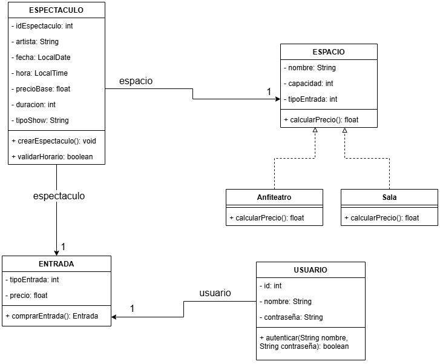

# Trabajo Practico Técnicas Avanzadas de Programación
## UNIVERSIDAD DE PALERMO

**Alumno**: Joaquin Serra  
**Legajo**: 0133581

**Docente**: Maria Alegre

**Primera entrega**: 28/04  
**Segunda entrega**: 09/06

---
### Diagrama de clases

### Modelo de datos
Para almacenar los datos voy a utilizar un modelo relacional.  
Existirá un usuario administrador que puede cargar espectaculos y otros usuarios que pueden comprar entradas.  
Cada espectaculo pertenece solo a un espacio que puede ser "Anfiteatro" o "Sala"
La entrada contiene el tipo de entrada (1. A;2. B;3. U); el precio total; informacion sobre el espectaculo

### Tecnologías para el proyecto.
* El proyecto va a ser realizado con Java 17 en intelliJ Community, Java es un lenguaje de programación orientado a objetos y ya estoy familiarizado con el mismo por eso mi elección.
  * IntelliJ ofrece una sencilla gestión de dependencias con Maven.
* El framework principal va a ser Spring junto con la extensión Spring Boot, que proporcionan un enfoque simplificado, modular y de rápido desarrollo para la creacion de aplicaciones con Java.
  * Nunca trabajé con frameworks en Java, y creo que este proyecto va a ser ideal para aprenderlo, además es muy solicitado en el ambiente laboral.
* Para gestionar la base de datos voy a utilizar PostgreSQL, ya que es un estandar profesional y puedo utilizar Hibernate para el mapeo de objetos.
  * Tampoco he trabajado con este gestor, pero estoy dispuesto a investigar lo necesario.
* El testing lo voy a hacer con JUnit 5, uno de los mas utilizados en Java
  * En primer lugar debo realizar tests unitarios sobre la lógica de los espectaculos y el login (Validación de horarios, cálculo de precios).
  * Una vez corregidos los modulos individuales, debo testear la integración entre ellos (Registro de los espectaculos).
* Docker para que el proyecto sea portable y accesible.  

