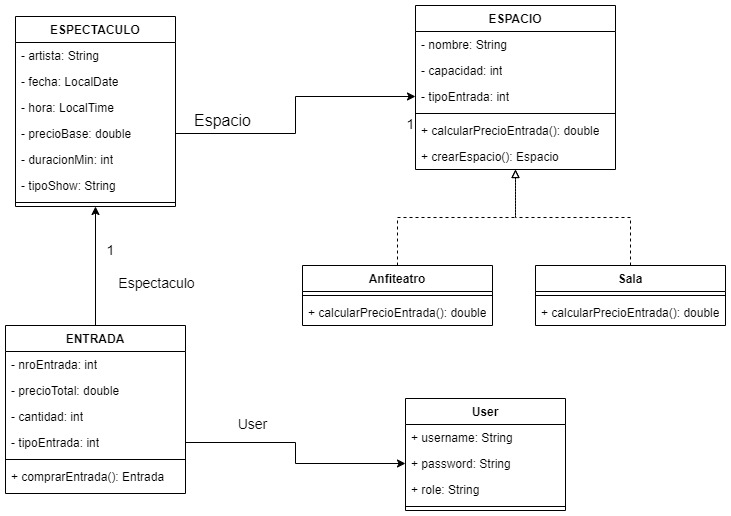

# Trabajo Practico Técnicas Avanzadas de Programación
## UNIVERSIDAD DE PALERMO


**Alumno**: Joaquin Serra  
**Legajo**: 0133581

**Docente**: Maria Alegre

**Primera entrega**: 28/04  
**Segunda entrega**: 09/06

***

## Pasos para levantar la API

1. Prerequisito fundamental tener instalado el motor de Docker
   * Para Linux
     * Puede instalarse y activarse por consola ejecutando

       ```bash
       sudo apt install docker.io
       sudo systemctl enable docker
       sudo systemctl start docker
       ```

   * Para Windows
     * Docker desktop con Windows Subsystem for Linux (WLS) configurado
   * Para Mac/OS
     * Docker desktop para Mac
   * Puede descargarse en https://www.docker.com/products/docker*desktop/


2. Para que el proyecto levante correctamente se debe renombrar el archivo “.env.example” a “.env” 
   * En este podrá modificar el usuario y la contraseña para acceder a la base de datos.  
   * Además puede modificar el puerto externo para acceder a la app (por defecto lo hace en el puerto 8081).


3. Con el motor de Docker corriendo, dirigirse a la raiz del proyecto y ejecutar el comando:   
    `docker compose up --build`  
   * Este comando va a instalar y levantar un contenedor con las imagenes necesarias, dependencias y configuraciones


4. Una vez levantado el contenedor ya puede acceder a [localhost:8081](http://localhost:8081/) (por defecto) o el puerto configurado en el archivo “.env”
   * Usuarios por defecto: 
     * Admin: `admin` / `admin`
     * User: `user` / `user`


5. Para acceder a la base de datos puede acceder con PgAdmin.
   * Paso a paso en [acceso PgAdmin](src/main/resources/static/acceso_pgAdmin.txt)


6. En la misma terminal donde se ejecutó el comando anterior 
   * Presione `Ctrl + C` para detener el contenedor.
   * Ejecute `docker compose down` para eliminar el contenedor y liberar los recursos del sistema.


## Diagrama de clases
    

## Modelo de datos
Para almacenar los datos voy a utilizar un modelo relacional.  

A continuacion se detallan las entidades, sus atributos y principales metodos:

**User:**
* Atributos: username, password y role (admin o usuario).  
  * El admin puede cargar y eliminar espectaculos.
  * El usuario y el admin pueden comprar entradas.  
 
**Espacio clase abstracta:**
* Atributos: nombre(Anfiteatro o Sala), capacidad, tipoEntrada (1_Preferencial o 2_General).  
  * Las entidades Sala y Anfiteatro heredan de Espacio.
  * El metodo abstracto calcularPrecioEntrada() es implementado por Sala y Anfiteatro para calcular el precio de las entradas.

**Espectaculo:**
* Atributos: artista, fecha, hora, precioBase, duracion, tipoShow, espacio.  
* En la base de datos existe la tabla espectaculos donde se almacenan.
* El EspectaculoService realiza una validacion de horarios para evitar que se superpongan espectaculos en el mismo espacio.  

**Entrada:**
* Atributos: nroEntrada, tipoEntrada (1_Preferencial o 2_General), precioTotal, cantidad.
  * Tiene una relacion 1 a muchos con Espectaculo, ya que cada entrada pertenece a un único espectaculo.
  * Tiene una relacion 1 a muchos con User, ya que cada entrada es comprada por un único usuario.
* Al comprar una entrada, se genera un número de entrada, teniendo en cuenta la cantidad adquirida.


## Tecnologías para el proyecto.
* El proyecto va a ser realizado con Java 17 en intelliJ Community, Java es un lenguaje de programación orientado a objetos y ya estoy familiarizado con el mismo por eso mi elección.
  * IntelliJ ofrece una sencilla gestión de dependencias con Maven.
* El framework principal va a ser Spring junto con la extensión Spring Boot, que proporcionan un enfoque simplificado, modular y de rápido desarrollo para la creacion de aplicaciones con Java.
  * Nunca trabajé con frameworks en Java, y creo que este proyecto va a ser ideal para aprenderlo, además es muy solicitado en el ambiente laboral.
* Para gestionar la base de datos voy a utilizar PostgreSQL, ya que es un estandar profesional y puedo utilizar Hibernate para el mapeo de objetos.
  * Tampoco he trabajado con este gestor, pero estoy dispuesto a investigar lo necesario.
* El testing lo voy a hacer con JUnit 5, uno de los mas utilizados en Java
  * En primer lugar debo realizar tests unitarios sobre la lógica de los espectaculos y el login (Validación de horarios, cálculo de precios).
  * Una vez corregidos los modulos individuales, debo testear la integración entre ellos (Registro de los espectaculos).
* Docker para que el proyecto sea portable y accesible.  


